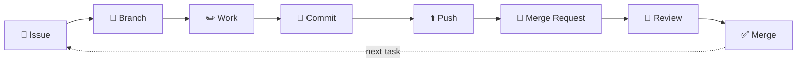

<div align="center">


&nbsp;
&nbsp;

# 🟣 The FINTEC GitLab Guide

**The official, beginner-friendly guide to GitLab at FINTEC AI.**

From *"what is a repository?"* to your first merged Merge Request — **no Git experience required.**

**[🚀 Start here](#start-here) · [🗺️ Roadmap](#the-learning-roadmap) · [🔎 "I want to…"](#i-want-to--jump-straight-to-your-task) · [🎨 Visual roadmap](roadmap.html) · [💬 finther.ai@finther.my](mailto:finther.ai@finther.my)**

</div>

---

## Start here

Three moves. That's all it takes to begin:

| | Move | Where it takes you |
|---|---|---|
| **1️⃣** | **Read [01 · What is GitLab?](docs/01-what-is-gitlab.md)** — 5 minutes, no jargon | You'll understand *why* we use this |
| **2️⃣** | **Create your account** — [02 · step-by-step](docs/02-create-your-gitlab-account.md) | You'll have a GitLab identity |
| **3️⃣** | **Follow the numbered roadmap below, in order** | Numbers 03 → 30 take you to full productivity |

> 💡 Prefer pictures? Open **[roadmap.html](roadmap.html)** — a visual, clickable version of this page. Works in any browser.

> 📌 **New employee, first day?** Your team lead adds you to the `ai-fintec` group ([how that works](docs/05-create-or-join-a-project.md)). Until then, everything from [01](docs/01-what-is-gitlab.md)–[04](docs/04-groups-projects-and-repositories.md) works with your own free account.

---

## The FINTEC workflow — one loop to memorise

Everything you'll ever do in GitLab is this loop. Every guide teaches one step of it:



| 🎫 | 🌿 | ✏️ | 📸 | ⬆️ | 🔀 | 👀 | ✅ |
|:---:|:---:|:---:|:---:|:---:|:---:|:---:|:---:|
| [Issue](docs/23-issues.md) | [Branch](docs/14-branches.md) | [Work](docs/15-making-changes.md) | [Commit](docs/16-commits.md) | [Push](docs/17-push.md) | [Merge Request](docs/19-create-a-merge-request.md) | [Review](docs/20-review-a-merge-request.md) | [Merge](docs/21-approve-and-merge.md) |

See it run end-to-end in **[26 · The FINTEC workflow](docs/26-the-fintec-workflow.md)** and **[27 · A real project, start to finish](docs/27-project-walkthrough.md)**.

---

## The learning roadmap

**Four parts, 30 numbered guides, ~4 hours total.** Read in order; each guide links onward. Short on time? Guides 01–18 make you operational, 19–25 make you a teammate, 26–30 make you self-sufficient.

### 🟢 Part 1 · Get set up — *account to access*

| # | Guide | You'll learn |
|:---:|---|---|
| 01 | [What is GitLab, and why does FINTEC use it?](docs/01-what-is-gitlab.md) | The big picture, in plain English — repo, commit, MR defined |
| 02 | [Create your GitLab account](docs/02-create-your-gitlab-account.md) | Sign-up, professional username, 2FA |
| 03 | [Sign in and understand the interface](docs/03-sign-in-and-the-interface.md) | Where everything lives — and how to never be lost |
| 04 | [Groups → Projects → Repositories](docs/04-groups-projects-and-repositories.md) | How GitLab organizes everything |
| 05 | [Create or join a project](docs/05-create-or-join-a-project.md) | Getting added, access requests, visibility |
| 06 | [Roles and permissions](docs/06-roles-and-permissions.md) | Guest → Owner — what *you* can do |
| 07 | [How FINTEC organizes projects](docs/07-how-fintec-organizes-projects.md) | Recommended group hygiene ⚠️ *recommendation, not policy* |

### 🔵 Part 2 · Your first work — *browser to terminal*

| # | Guide | You'll learn |
|:---:|---|---|
| 08 | [Create a project from scratch](docs/08-create-a-project-from-scratch.md) | Every click, with naming rules |
| 09 | [Create and upload files](docs/09-create-and-upload-files.md) | Web editor + Web IDE — no installs |
| 10 | [Choosing your tool](docs/10-choosing-your-tool.md) | Web vs Web IDE vs Git vs `glab` + token setup |
| 11 | [Clone a project](docs/11-clone-a-project.md) | *First terminal guide* — HTTPS, step by step |
| 12 | [Git concepts in plain English](docs/12-git-concepts-in-plain-english.md) | The 6 ideas behind every command |
| 13 | [Everyday Git commands](docs/13-everyday-git-commands.md) | The only 6 you need + printable cheatsheet |
| 14 | [Branches](docs/14-branches.md) | Why they exist + 4 ways to create one |
| 15 | [Making changes](docs/15-making-changes.md) | The golden rule: one branch, one task |
| 16 | [Commits](docs/16-commits.md) | Snapshots + messages people thank you for |
| 17 | [Push](docs/17-push.md) | Share your work (and why `--force` is banned) |
| 18 | [Pull](docs/18-pull.md) | Stay in sync — the habit that prevents conflicts |

### 🟣 Part 3 · Working as a team — *the heart of it*

| # | Guide | You'll learn |
|:---:|---|---|
| 19 | [Create a Merge Request](docs/19-create-a-merge-request.md) | The proposal, `Closes #12`, Drafts |
| 20 | [Review someone's Merge Request](docs/20-review-a-merge-request.md) | Kind, specific, useful feedback |
| 21 | [Approve and merge](docs/21-approve-and-merge.md) | The finish line + what auto-happens |
| 22 | [Fix merge conflicts (calmly)](docs/22-fix-merge-conflicts.md) | 3 ways — no drama |
| 23 | [Issues](docs/23-issues.md) | Tasks, bugs, requests — tracked properly |
| 24 | [Linking Issues → Branches → MRs](docs/24-link-issues-branches-merge-requests.md) | The one-click connection + auto-close |
| 25 | [READMEs and documentation](docs/25-readme-and-documentation.md) | Docs that pass the 60-second test |

### ⚫ Part 4 · Work like FINTEC — *real-world ready*

| # | Guide | You'll learn |
|:---:|---|---|
| 26 | [The FINTEC workflow](docs/26-the-fintec-workflow.md) | The whole loop on one page |
| 27 | [A real project, start to finish](docs/27-project-walkthrough.md) | Every guide, one story |
| 28 | [Common mistakes and recovery](docs/28-common-mistakes-and-recovery.md) | 14 first-aid fixes — keep as reference |
| 29 | [Security basics](docs/29-security-basics.md) | Secrets, tokens, `.env` — the one rule |
| 30 | ["What do I do next?"](docs/30-what-do-i-do-next.md) | The everyday answer page — bookmark it |

### 🎓 Optional · Advanced track — *separate from the beginner path*

| Guide | You'll learn |
|---|---|
| [Advanced 01 · SSH access](docs/advanced/01-ssh-access.md) | Key-based auth — *deliberately not the beginner default* |
| [Advanced 02 · `glab` CLI](docs/advanced/02-glab-cli.md) | GitLab from the terminal |
| [Advanced 03 · Protected branches & approvals](docs/advanced/03-protected-branches-and-approvals.md) | Maintainer configuration |
| [Advanced 04 · Git power moves](docs/advanced/04-git-power-moves.md) | Stash, rebase, reflog, bisect |

---

## "I want to…" — jump straight to your task

<details open>
<summary><b>Click a question — every answer is one link away</b></summary>

| I want to… | Do this |
|---|---|
| **…know what GitLab is** | [01 · What is GitLab?](docs/01-what-is-gitlab.md) |
| **…create an account** | [02 · Create your account](docs/02-create-your-gitlab-account.md) |
| **…find a project / get access** | [05 · Create or join a project](docs/05-create-or-join-a-project.md) |
| **…create a new project** | [08 · From scratch](docs/08-create-a-project-from-scratch.md) |
| **…fix a typo without installing anything** | [09 · Web editor — pencil icon ✏️](docs/09-create-and-upload-files.md) |
| **…understand "commit" / "branch" / "push"** | [12 · Concepts in plain English](docs/12-git-concepts-in-plain-english.md) |
| **…get a project onto my computer** | [11 · Clone](docs/11-clone-a-project.md) |
| **…start working on my assigned task** | [26 · The workflow](docs/26-the-fintec-workflow.md) → [14 · Branch](docs/14-branches.md) |
| **…save my progress** | [16 · Commits](docs/16-commits.md) |
| **…let others see my work** | [17 · Push](docs/17-push.md) |
| **…ask for my code to be merged** | [19 · Create a Merge Request](docs/19-create-a-merge-request.md) |
| **…review a teammate's code** | [20 · Reviewing](docs/20-review-a-merge-request.md) |
| **…report a bug or request a feature** | [23 · Issues](docs/23-issues.md) |
| **…resolve a merge conflict** | [22 · Conflicts, calmly](docs/22-fix-merge-conflicts.md) |
| **…undo a mistake** | [28 · Common mistakes and recovery](docs/28-common-mistakes-and-recovery.md) |
| **…know where secrets are allowed** | [29 · Security basics](docs/29-security-basics.md) — *short version: nowhere in Git* |
| **…know who to ask / what to do next** | [30 · The answer page](docs/30-what-do-i-do-next.md) |

</details>

---

## Which tool when?

| Tool | Install | Use it for | Learn it in |
|---|:---:|---|---|
| 🌐 **GitLab web** | none | reading, issues, reviews, small edits | [09](docs/09-create-and-upload-files.md) |
| 🖥️ **Web IDE** | none | multi-file edits from any browser | [09](docs/09-create-and-upload-files.md) |
| ⌨️ **Git terminal** | [Git](https://git-scm.com/downloads) | real development work | [11](docs/11-clone-a-project.md)–[18](docs/18-pull.md) |
| 🦊 **`glab` CLI** | [glab](https://gitlab.com/gitlab-org/cli) | MRs/issues from the terminal | [Advanced 02](docs/advanced/02-glab-cli.md) |

> 🎯 **Nobody is forced onto the terminal.** The browser carries you through the entire workflow — the terminal earns its place as your work gets deeper.

---

## Quick reference card

```text
┌──────────────────── FINTEC DAILY LOOP ────────────────────┐
│  1. git switch main && git pull     start fresh           │
│  2. git switch -c 12-my-task        new branch per task   │
│  3. …work…                          one task, one branch  │
│  4. git add . && git commit -m "…"  snapshot + real msg   │
│  5. git push -u origin 12-my-task   first push (then:     │
│     git push)                       share + backup        │
│  6. Merge Request: "Closes #12"     reviewer + how-test   │
│  7. Review → Merge                  someone else approves │
└───────────────────────────────────────────────────────────┘
     Full cheatsheet: 13 · Everyday Git commands
     Stuck?           30 · "What do I do next?"
```

---

## For maintainers of this guide

- **Found an error or a confusing section?** Open an Issue in this repo — this guide follows its own advice ([23 · Issues](docs/23-issues.md)) 🙂
- **Proposing changes:** branch + Merge Request, same as any project. Keep the beginner path beginner-only; advanced material goes in [docs/advanced/](docs/advanced/01-ssh-access.md)
- **Adding a guide:** keep the numbered sequence, follow the existing format (time/level header, plain-English first, prev/next links at the bottom), and update the tables in this README

## Notes & disclaimers

- 🔒 FINTEC projects live in the [`ai-fintec`](https://gitlab.com/ai-fintec) group on gitlab.com. Access questions: your team lead, or **[finther.ai@finther.my](mailto:finther.ai@finther.my)**
- ⚠️ Items marked *recommendation* (e.g. [07 · project organization](docs/07-how-fintec-organizes-projects.md), tool preferences) are sensible defaults — **not official FINTEC policy** unless your lead says otherwise
- 📖 Official GitLab documentation: [docs.gitlab.com](https://docs.gitlab.com) · GitLab service status: [status.gitlab.com](https://status.gitlab.com)

---

<div align="center">

**[🚀 Start guide 01 now](docs/01-what-is-gitlab.md)** — it's five minutes, and it makes everything else make sense.

*Built with 🟣 by the FINTEC AI team · maintained in this repository*

</div>
