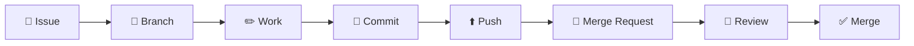

# 26 · The FINTEC workflow — one loop to memorise

> ⏱️ **~10 min** · 🎯 **Level: Beginner · the big picture** · 🧰 **Tool needed: whatever the step needs**

---

## The loop

Every piece of work at FINTEC follows the same eight steps:



> **Issue → Branch → Work → Commit → Push → Merge Request → Review → Merge**

Eight steps, and you already know every single one from the earlier guides. This page just ties them into **one rhythm you can run on autopilot**.

## Why a *standard* workflow matters

Not bureaucracy — **predictability**:

- Anyone can open any project and instantly see what's in flight (Issues) and what's pending (MRs)
- Reviews stay small and fast, conflicts stay rare ([22](22-fix-merge-conflicts.md))
- Nobody's work blocks anyone else's ([14 · Branches](14-branches.md))
- "Is this done?" always has the same answer: *merged, and its Issue closed*

## The eight steps, with their guides

| # | Step | One-line job | Deep dive |
|---|---|---|---|
| 1 | 🎫 **Issue** | Track *what* and *why* — one task per Issue | [23 · Issues](23-issues.md) |
| 2 | 🌿 **Branch** | One task = one branch, from fresh `main`, named `12-short-name` | [14 · Branches](14-branches.md) |
| 3 | ✏️ **Work** | Edit files; one branch = one logical change | [15 · Making changes](15-making-changes.md) |
| 4 | 📸 **Commit** | Snapshot each working state with a real message | [16 · Commits](16-commits.md) |
| 5 | ⬆️ **Push** | Upload your branch — your backup and your visibility | [17 · Push](17-push.md) |
| 6 | 🔀 **Merge Request** | Propose it: `Closes #12`, reviewer assigned, how-to-test written | [19 · Create an MR](19-create-a-merge-request.md) |
| 7 | 👀 **Review** | Someone else's eyes; fix, push, repeat — calmly | [20 · Reviewing](20-review-a-merge-request.md) |
| 8 | ✅ **Merge** | Approved → into `main`; branch deleted; **Issue auto-closes** | [21 · Approve and merge](21-approve-and-merge.md) |

## The loop in one real story

**Task:** *"Show total interest paid over the loan lifetime"* — project `ai-fintec/loan-calculator`, developer Siti, reviewer Ahmad.

```text
🎫  Siti opens Issue #12 …or finds it already filed and claims it
🌿  clicks "Create merge request" on the issue
    → branch 12-show-total-interest + Draft MR, "Closes #12" pre-filled
✏️  adds the total-interest calculation + display
    (git status / git diff before finishing — [15])
📸  git commit -m "Show total interest paid under the payment table"
⬆️  git push        (first push: git push -u origin 12-show-total-interest)
🔀  polishes the Draft MR: What / Why / How to test, assigns Ahmad
    removes the Draft: prefix
👀  Ahmad reviews: one Nit (variable name), one ✅ Approve
    Siti fixes the nit, pushes — MR updates itself
✅  Ahmad merges → branch deleted → Issue #12 closes itself
    Siti: git switch main && git pull → next Issue ☕
```

Six working hours, zero chat messages needed to reconstruct any of it, forever. That's the workflow paying rent.

## Speed matters more than perfection

The loop is designed for **small and frequent**, not grand and rare:

| | ✅ Small & frequent | ❌ Big & rare |
|---|---|---|
| Branch lifetime | 1–3 days | 3 weeks |
| MR size | ~50–200 changed lines | 1,500 lines nobody reads properly |
| Review turnaround | same day | "I'll get to it…" |
| Conflicts | rare and tiny | guaranteed and enormous ([22](22-fix-merge-conflicts.md)) |

One branch per task. Done means *merged* — not *pushed*, not *"works on my machine"*.

## Choosing the right tool per step

| Step | 🌐 Web | 🖥️ Web IDE | ⌨️ Terminal | 🦊 glab |
|---|:-:|:-:|:-:|:-:|
| Issue | ✅ best | — | — | later |
| Branch | ✅ | ✅ | ✅ | later |
| Work | small edits | quick multi-file | **real dev work** | — |
| Commit | small edits | ✅ | ✅ | — |
| Push | (auto on web commit) | (auto) | ✅ only | ✅ |
| MR | ✅ best | ✅ | via push-link | later |
| Review | ✅ only | — | — | — |
| Merge | ✅ best | — | — | later |

Read it and relax: **the browser carries you through all eight steps.** The terminal earns its keep at *Work/Commit/Push*; `glab` is a later-game power-up ([Advanced · 02 · glab CLI](advanced/02-glab-cli.md)). Full tool guide: [10 · Choosing your tool](10-choosing-your-tool.md).

## The anti-patterns (all real, all avoidable)

| 🚫 Anti-pattern | Why it hurts | Do instead |
|---|---|---|
| Pushing straight to `main` | skips review; usually blocked anyway | trust the loop ([14](14-branches.md)) |
| One giant "everything" MR | unreviewable, unmergeable | split per task |
| Work without an Issue | invisible, unprioritisable | 60 seconds to file it ([23](23-issues.md)) |
| Merge *your own* MR unreviewed | "review" becomes theatre | someone else's eyes, always ([20](20-review-a-merge-request.md)) |
| Week-old branches | conflict factories | small + frequent, merge `main` into long branches ([18](18-pull.md)) |
| Secrets committed in step 3–4 | history is forever → [29 · Security basics](29-security-basics.md) | scan before every commit |

## Your turn — the full circle

You've read the pieces; now run the loop once end-to-end on a sandbox project ([08 · Create a project](08-create-a-project-from-scratch.md) — personal namespace is fine for practice):

Issue → Branch → Work → Commit → Push → MR → review yourself as practice → Merge.

Then read [27 · A real project from start to finish](27-project-walkthrough.md) to see it again, expanded, with every decision explained.

---

[⬅️ 25 · READMEs and documentation](25-readme-and-documentation.md) · [27 · Project walkthrough ➡️](27-project-walkthrough.md)
